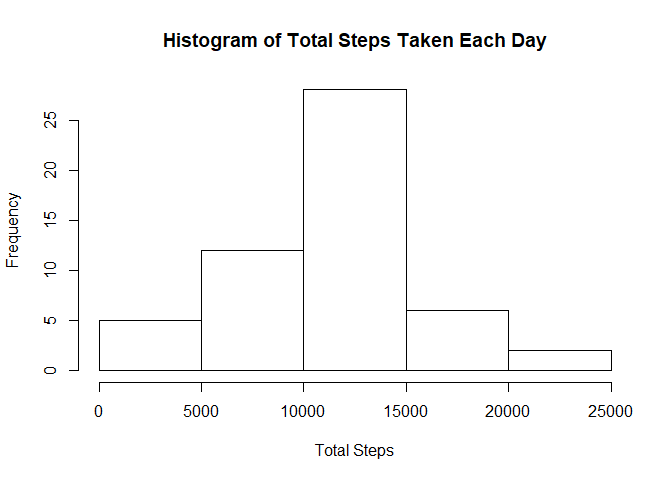
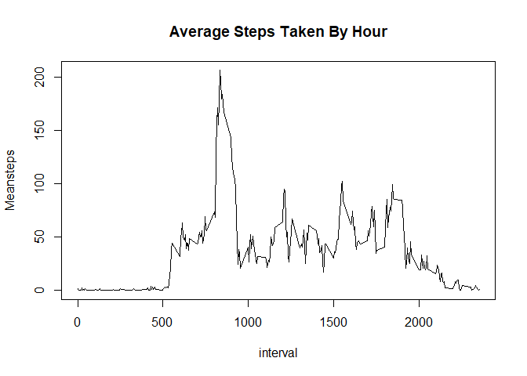

### Notes

Following scripts use functions from tidyverse library which includes
dplyr, ggplot2 and other useful packages.

### Loading and Preprocessing the Data

    data <- read.csv("activity.csv")

#### Converting the type of date variable from factor to date

    data$date <-  as.Date(data$date,  "%Y-%m-%d")

### Part I: What is mean total number of steps taken per day?

#### 1. Total steps taken by date computed using dplyr functions group\_by and summarize

    data2 <- data %>% group_by(date) %>% summarise(Totalsteps = sum(steps)) %>% print()

    ## # A tibble: 61 x 2
    ##    date       Totalsteps
    ##    <date>          <int>
    ##  1 2012-10-01         NA
    ##  2 2012-10-02        126
    ##  3 2012-10-03      11352
    ##  4 2012-10-04      12116
    ##  5 2012-10-05      13294
    ##  6 2012-10-06      15420
    ##  7 2012-10-07      11015
    ##  8 2012-10-08         NA
    ##  9 2012-10-09      12811
    ## 10 2012-10-10       9900
    ## # ... with 51 more rows

#### 2. Histogram of the total number of steps taken each day

    hist(data2$Totalsteps, main = "Histogram of Total Steps Taken Each Day", xlab = "Total Steps")

#### 3. The mean of total steps taken with missing values removed

    mean(data2$Totalsteps, na.rm = T)

    ## [1] 10766.19

#### 4. The median of total steps taken with missing values removed

    median(data2$Totalsteps, na.rm = T)

    ## [1] 10765

### Part II: What is the average daily activity pattern?

#### 1. Time series plot of 5 minute intervals (x axis) and average number of steps taken averaged across all days (y axis)

    data3 <- data %>% group_by(interval) %>% summarise(Meansteps = mean(steps, na.rm = T))

    plot(data3, type="l", main= "Average Steps Taken By Hour")

#### 2. The 5 minute interval containing highest amount of average steps taken

    data3[which.max(data3$Meansteps),]

    ## # A tibble: 1 x 2
    ##   interval Meansteps
    ##      <int>     <dbl>
    ## 1      835      206.

### Part III: Imputing missing values

#### 1. Total number of missing values in the dataset

    sum(is.na(data))

    ## [1] 2304

#### 2. Filling the missing values with means of 5 minute intervals and creating a new dataset

    data4 <- data %>% group_by(interval) %>% mutate_at(vars(steps), ~replace(., is.na(.), mean(steps, na.rm = T))) %>% ungroup()

#### 3. Histogram of the total number of steps with NAs filled

    data5 <- data4 %>% group_by(date) %>% summarise(Totalsteps = sum(steps))

    hist(data5$Totalsteps, main = "Histogram of Total Steps Taken Each Day (NAs filled)", xlab = "Total Steps")

#### 4. Mean and median total number of steps taken per day with NAs filled

    mean(data5$Totalsteps, na.rm = T)

    ## [1] 10766.19

    median(data5$Totalsteps, na.rm = T)

    ## [1] 10766.19

#### Comments: As we can see imputing missing values has almost no effect on mean and median values.

### Part IV: Are there differences in activity patterns between weekdays and weekends?

#### 1. Creating a new factor variable in the dataset with two levels – “weekday” and “weekend” indicating whether a given date is a weekday or weekend day.

    data4 <- data4 %>% mutate(Week = weekdays(date))
    data4$Week <- as.factor(data4$Week)
    data4$Week <- fct_collapse(data4$Week, weekday = c("Monday", "Tuesday", "Wednesday", "Thursday", "Friday"), 
                               weekend =  c("Saturday", "Sunday"))

#### 2. Panel plot showing time series plot of the 5-minute interval (x-axis) and the average number of steps taken, averaged across all weekday days or weekend days (y-axis)

    data6 <- data4 %>% group_by(interval, Week) %>% summarise(Meansteps = mean(steps))  

    ggplot(data6, aes(x =interval, y = Meansteps)) + labs(y = "Average Number of Steps", y = "Year") +
      geom_line(color = "blue", stat="identity") + facet_grid(rows = vars(data6$Week)) + guides(fill=FALSE)

#### Comments: We can see that on weekdays, presumably due to work, number of steps spike around 08.30 then fall down while on weekends it shows a more even distribution.
